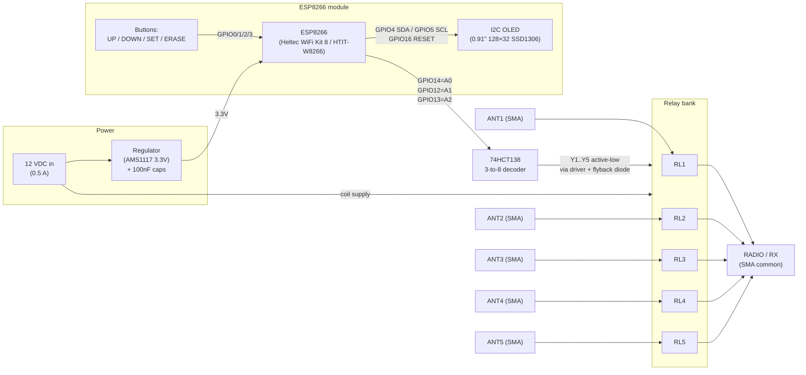

# Schematic & Enclosure — 5-Port Antenna Switch (ANTENNA SELECTOR V2)

Redrawn from the original board schematic (ANTENI.NET "ANTENNAS webSWITCH control
1 to 5") combined with the GPIO assignments recovered from firmware
(see [`hardware-pinout.md`](hardware-pinout.md) and
[`74hct138-truth-table.md`](74hct138-truth-table.md)).

The system has:

- **5 antenna inputs** (SMA): ANT1–ANT5
- **1 receiver/radio output** (SMA): to the RX
- **12 VDC power input** (0.5 A) for the relay coils, regulated down for logic
- an **ESP8266** (Heltec WiFi Kit 8 / HTIT-W8266, with an on-board 0.91" 128×32
  SSD1306 OLED) driving a **74HCT138** decoder → **5 relays** (RL1–RL5)

---

## Physical enclosure layout

### Front panel

The ESP8266 module faces forward with its **OLED screen centred** in the box. To the
right are the two selector buttons, stacked vertically (**UP** on top, **DOWN**
below).

```
        ┌─────────────────────────────────────────────┐
        │                                               │
        │              ┌───────────────┐                │
        │              │   OLED  ANT:n  │       ( O )  UP   ← GPIO3
        │              │  0.91" 128×32  │                │
        │              │   (SSD1306)    │       ( O )  DOWN ← GPIO1
        │              └───────────────┘                │
        │                                               │
        │                  [ FRONT ]                    │
        └─────────────────────────────────────────────┘
```

### Rear panel

Left → right: **Power in**, **Radio (RX) port**, the **five antenna ports**, then the
**MAX antenna** button, then the **ERASE WiFi/SSID** button.

```
   ┌──────────────────────────────────────────────────────────────────────┐
   │                                                                        │
   │  (12V)   (RADIO)    (A1)(A2)(A3)(A4)(A5)        (O)          (O)       │
   │  POWER    RX/OUT     5 × ANTENNA INPUTS         MAX          ERASE     │
   │   IN      (SMA)          (SMA)                 ANTENNA      WiFi/SSID   │
   │                                              (SET,GPIO0)   (ERASE,GPIO2)│
   │                              [ REAR ]                                   │
   └──────────────────────────────────────────────────────────────────────┘
```

Button-to-GPIO mapping (see [`buttons.md`](buttons.md)):

| Panel | Button | GPIO | Function |
|-------|--------|:----:|----------|
| Front (top) | UP | GPIO3 | next antenna |
| Front (bottom) | DOWN | GPIO1 | previous antenna |
| Rear | MAX ANTENNA | GPIO0 | set the highest selectable antenna number |
| Rear | ERASE WiFi/SSID | GPIO2 | hold to erase stored WiFi config |

Rear connector order (left → right):

| # | Connector | Type |
|---|-----------|------|
| 1 | 12 VDC power in | barrel/screw, 0.5 A |
| 2 | RADIO (RX) | SMA — common output to the receiver |
| 3–7 | ANT1 … ANT5 | SMA — antenna inputs |

---

## Block diagram (signal + control flow)



> The 74HCT138 asserts exactly one active-low output for the 3-bit code on
> A2/A1/A0, so exactly one relay closes and exactly one antenna reaches the radio
> port. Code `000` = all relays open = **GROUND** (antenna disconnected).

---

## RF path — functional view

```
 ANT1 ○──/ RL1 \──┐
 ANT2 ○──/ RL2 \──┤
 ANT3 ○──/ RL3 \──┼───○ RADIO (RX common SMA)
 ANT4 ○──/ RL4 \──┤
 ANT5 ○──/ RL5 \──┘
                  (only one relay closed at a time)
```

This is the *logical* result: each relay connects its ANTn SMA to the common RADIO
SMA, and only one is closed at a time (code 000 = none = grounded/disconnected). It
is easy to read but is **not** how the relay contacts are physically wired — for that,
see the detailed RF schematic below.

## RF path — detailed schematic (as drawn in the manufacturer scan)

On the board each relay is an **SPDT** device whose contacts are chained so the RF
signal path **passes through** every un-selected relay and is **tapped out** at the
selected one. Energising relay N connects ANTn to the through-line that runs to the
Radio port; de-energised relays route straight through to the next stage.

```
                 RL1        RL2        RL3        RL4        RL5
              ┌────────┐ ┌────────┐ ┌────────┐ ┌────────┐ ┌────────┐
  common ─────┤ C   NC ├─┤ C   NC ├─┤ C   NC ├─┤ C   NC ├─┤ C   NC ├── (chain end)
  RF bus      │    \   │ │    \   │ │    \   │ │    \   │ │    \   │
 (to RADIO)   │  NO │  │ │  NO │  │ │  NO │  │ │  NO │  │ │  NO │  │
              └───┬────┘ └───┬────┘ └───┬────┘ └───┬────┘ └───┬────┘
                  │          │          │          │          │
                 ANT1       ANT2       ANT3       ANT4       ANT5
                (SMA)      (SMA)      (SMA)      (SMA)      (SMA)

   C  = common (pole)      NO = normally-open  (connects ANTn when relay energised)
   NC = normally-closed (through path when relay de-energised)
```

- The **common / through RF bus** connects to the **RADIO (RX)** SMA (with the 100 nF
  DC-block / bypass cap C2 seen in the scan).
- When **relay N is energised**, its pole switches from NC (pass-through) to NO,
  connecting **ANTn** onto the bus → out to the Radio port.
- With **no relay energised** (decoder code `000`), the bus reaches the chain end with
  no antenna tapped in → the Radio port is disconnected = **GROUND**.
- All SMA connector shields tie to the common ground.

### Per-relay coil drive (as in the scan)

```
        +12V ─────────────┬─────────────────────
                          │  ▲ Dn (flyback, cathode to +12V)
                    relay coil (RLn)
                          │
   74HCT138 Yn ──[ Rn ]───┴──►│ (driver)──► GND
     (active-low select)        switches the low side of the coil
```

- `Rn` (R11–R15) sets the base/gate drive; `Dn` (D1–D5) clamps the coil's
  back-EMF (cathode to +12 V).
- The selected decoder output pulls its relay coil's low side, energising exactly
  that relay.

---

## Control / driver path (per relay)

```
 74HCT138 Yn ──►│ driver transistor (Rbb base resistor) ──► relay coil ──► +12V
   (active low)      │                                         │
                     └── (NPN/level shift)          flyback diode Dn across coil
                                                     (cathode to +12V)
```

- `R11–R15` — base resistors for the relay-driver transistors
- `D1–D5` — flyback (freewheeling) diodes across each relay coil
- Coils are powered from the **+12 V** rail; the decoder output switches the
  low side through the driver.

---

## Full connection table

### ESP8266 GPIO

| GPIO | Net | To |
|------|-----|----|
| GPIO14 | SEL_A0 | 74HCT138 pin A0 |
| GPIO12 | SEL_A1 | 74HCT138 pin A1 |
| GPIO13 | SEL_A2 | 74HCT138 pin A2 |
| GPIO0  | BTN_SET | SET button → GND (active low) |
| GPIO1  | BTN_DOWN | DOWN button → GND (active low) |
| GPIO2  | BTN_ERASE | ERASE button → GND (active low) |
| GPIO3  | BTN_UP | UP button → GND (active low) |
| GPIO4  | I2C_SDA | OLED SDA (0.91" 128×32 SSD1306) |
| GPIO5  | I2C_SCL | OLED SCL (0.91" 128×32 SSD1306) |
| GPIO16 | OLED_RST | OLED reset (Heltec WiFi Kit 8) |
| 3V3 / GND | power | from regulator |

### 74HCT138 (3-to-8 decoder)

| Pin | Net | Notes |
|-----|-----|-------|
| A0 (1) | SEL_A0 | from GPIO14 |
| A1 (2) | SEL_A1 | from GPIO12 |
| A2 (3) | SEL_A2 | from GPIO13 |
| E1̄ (4), E2̄ (5) | GND | active-low enables tied low (enabled) |
| E3 (6) | +Vcc | active-high enable tied high (enabled) |
| Y0 (15) | — | code 000 = GROUND (no relay) |
| Y1 (14) | RL1 drive | → ANT1 |
| Y2 (13) | RL2 drive | → ANT2 |
| Y3 (12) | RL3 drive | → ANT3 |
| Y4 (11) | RL4 drive | → ANT4 |
| Y5 (10) | RL5 drive | → ANT5 |
| Y6 (9), Y7 (7) | (unused) | ANT6/7 not populated |
| Vcc (16) / GND (8) | power | |

### Relays & RF connectors

| Relay | Driver | Flyback | Antenna in | Common out |
|-------|--------|---------|-----------|------------|
| RL1 | R11 + Q | D1 | ANT1 (SMA) | RADIO (SMA) |
| RL2 | R12 + Q | D2 | ANT2 (SMA) | RADIO (SMA) |
| RL3 | R13 + Q | D3 | ANT3 (SMA) | RADIO (SMA) |
| RL4 | R14 + Q | D4 | ANT4 (SMA) | RADIO (SMA) |
| RL5 | R15 + Q | D5 | ANT5 (SMA) | RADIO (SMA) |

### Power

| Rail | Source | Feeds |
|------|--------|-------|
| +12 VDC (0.5 A) | barrel/screw input | relay coils, regulator input |
| +3.3 V | on-board regulator (AMS1117) | ESP8266, 74HCT138, OLED |
| GND | common | everything, SMA shields |

---

## Known components (bill of materials from the scan)

Every discrete part identifiable in the manufacturer scan. Values are shown where
legible in the photo; "≈" / "?" marks a best-effort read.

| Ref | Type | Value / part | Where / purpose |
|-----|------|--------------|-----------------|
| **U (MCU)** | MCU board | **Heltec WiFi Kit 8 (HTIT-W8266)** ESP8266 | controller (on-board OLED) |
| **U (dec.)** | Logic IC | **74HCT138** | 3-to-8 decoder (antenna select) |
| **U (reg.)** | Regulator | **AMS1117** (Vin / Vout / GND) | 12 V → 3.3 V for logic |
| **U (disp.)** | Display | 0.91" 128×32 **SSD1306** OLED (I²C, reset GPIO16) | status display |
| **RL1–RL5** | Relay | SPDT signal relay ×5 | RF antenna switching |
| **D1** | Diode | flyback (1N4148 / 1N400x-class) | across RL1 coil |
| **D2** | Diode | flyback | across RL2 coil |
| **D3** | Diode | flyback | across RL3 coil |
| **D4** | Diode | flyback | across RL4 coil |
| **D5** | Diode | flyback | across RL5 coil |
| **R11–R15** | Resistor | relay-driver base / series | one per relay (RL1–RL5) |
| **C1** | Capacitor | **100 nF** | regulator input decoupling |
| **C2** | Capacitor | **100 nF** | regulator output / Radio-port bypass |
| **R (pull-up)** | Resistor | **≈10 kΩ** | button input pull-up(s) |
| **R (series)** | Resistor | **≈47 (Ω?)** | button / debounce series (value uncertain) |
| **S1–S4** | Push-button | momentary ×4 | UP / DOWN / SET(MAX) / ERASE |
| **A1–A5** | Connector | SMA ×5 | antenna inputs |
| **Radio** | Connector | SMA | receiver / RX common output |
| **12 V** | Connector | DC power in (~0.5 A) | supply |

**Components we are confident about:**

- **Diodes:** **D1–D5** — the five relay-coil **flyback diodes** (one clearly drawn
  beside each relay in the scan).
- **Capacitors:** **C1** and **C2**, both **100 nF** — at the AMS1117 regulator
  (input/output) and the Radio-port bypass.
- **Resistors:** **R11–R15** (relay driver, one per relay) and button pull-up(s)
  around **10 kΩ**.

**Not fully legible in the source photo** (given functionally): exact resistor values,
the diode part numbers, and the relay-driver transistor type/part numbers.

---

## Selection logic (recap)

| A0 (G14) | A1 (G12) | A2 (G13) | Decoder | Result |
|:--------:|:--------:|:--------:|:-------:|--------|
| 0 | 0 | 0 | Y0 | GROUND (all relays open) |
| 1 | 0 | 0 | Y1 | ANT1 → RADIO |
| 0 | 1 | 0 | Y2 | ANT2 → RADIO |
| 1 | 1 | 0 | Y3 | ANT3 → RADIO |
| 0 | 0 | 1 | Y4 | ANT4 → RADIO |
| 1 | 0 | 1 | Y5 | ANT5 → RADIO |

(Codes 110/111 would select the unpopulated ANT6/ANT7.)

---

> **Note:** Component references (R11–R15, D1–D5, RL1–RL5, regulator type, exact
> 74HCT138 enable strapping) are taken from the original board schematic photo; the
> GPIO net names are confirmed from the firmware. Transistor/exact passive values
> were not all legible in the source photo and are shown functionally.

---

## Comparison to the original manufacturer scan

The redrawing above was checked against the original "ANTENNAS webSWITCH control 1
to 5" schematic scan. Overall it **matches well**, with a few clarifications and one
topology correction noted below.

### Confirmed matching

| Element in the scan | In our docs |
|---------------------|-------------|
| Title "ANTENNAS webSWITCH control 1 to 5" | ✅ |
| ESP8266 dev board (USB, on-board buttons, pin labels) | ✅ |
| **74HCT138** decoder driven by the ESP | ✅ (GPIO14/12/13 → A0/A1/A2) |
| **5 relays** RL1–RL5 | ✅ |
| **5 flyback diodes** D1–D5 (one per relay) | ✅ |
| Series base resistors R11–R15 | ✅ |
| **5 antenna SMA jacks** A1–A5, each with GND | ✅ |
| Common **"Radio"** SMA output (with 100 nF cap C2) | ✅ |
| **12 VDC** input (labelled ~0.5 A) | ✅ |
| **AMS1117** regulator block (Vin / Vout / GND, C1/C2 100 nF) | ✅ |
| Push-buttons S1–S4 + pull-up resistors (10k) | ✅ (UP/DOWN/SET/ERASE) |
| "REMOTE CONTROL (per module)" relay section | ✅ (the relay bank) |

### RF topology — now drawn faithfully

The two views above are provided precisely so our docs **do** match the scan:

- **RF path — functional view** = the easy-to-read logical result.
- **RF path — detailed schematic** = the actual **SPDT relay cascade** as drawn in
  the manufacturer scan: each relay's common pole is on the through/RF bus, its
  normally-closed contact passes the signal to the next relay, and its normally-open
  contact taps in that relay's antenna when energised.

Both describe the same behaviour (exactly one antenna → Radio; all-off = grounded);
the detailed view additionally reproduces the physical contact wiring, so there is no
longer a discrepancy with the scan.

- **Relay coil drive:** each 74HCT138 output drives its relay via the series resistor
  (R1x) and its flyback diode (D1x); discrete transistor symbols were not clearly
  legible, so the "driver transistor" in the per-relay diagram is shown functionally
  (the decoder output ultimately switches the coil, with the diode clamping the coil).

- **Regulator confirmed as AMS1117** (the Vin/Vout/GND block with two 100 nF caps),
  supplying the ESP/logic from the 12 V rail.

### Net assessment

The block diagram, decoder truth table, GPIO/button/OLED/power mapping, and connector
set all agree with the scan. The only substantive refinement is the **relay RF wiring
(SPDT cascade vs. simplified parallel)**; this does not change how the switch is
controlled or how replacement firmware should drive it.
